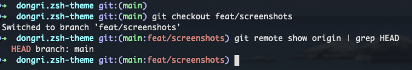

# dongri.zsh-theme

An oh-my-zsh theme that shows both the default branch and current branch.



## Features

- Shows `origin/HEAD` (default branch) alongside the current branch
- Based on the classic `robbyrussell` theme
- Dirty state indicator

## Installation

### Manual

```sh
git clone https://github.com/dongri/dongri.zsh-theme.git \
  ${ZSH_CUSTOM:-~/.oh-my-zsh/custom}/themes/dongri
ln -s ${ZSH_CUSTOM:-~/.oh-my-zsh/custom}/themes/dongri/dongri.zsh-theme \
  ${ZSH_CUSTOM:-~/.oh-my-zsh/custom}/themes/dongri.zsh-theme
```

Then set in your `~/.zshrc`:

```sh
ZSH_THEME="dongri"
```

## License

MIT
